# Sequence Detection using Moore FSM

This project simulates the design of a Sequence Detector built using the MOORE FSM logic. We can detect a pre-decided 4 bit sequence and provide an output high when the sequence is detected. The following circuit design can detect overlapping sequences.


## Introduction

### Sequence Detectors

A **sequence detector** is a type of sequential circuit designed to recognize a specific pattern of bits in its input stream. Its output is **HIGH** (or logic 1) only when the target pattern is successfully detected; otherwise, the output remains **LOW** (or logic 0).

### Moore FSM 

**Moore Finite State Machines** (FSMs) are a specific model of sequential circuit characterized by how their output is generated. In a Moore machine, the output value is determined solely by the circuit's **current state**. Consequently, the output is independent of the immediate or previous input values leading up to the current state.

### Applications

A Sequence Detector can be used in the following areas:
- Binary sequences are inserted at the beginning (or end) of a data frame or subframe emanating from a digital data processor of a spacecraft. Sequence detectors are used in the decoding equipment on the ground to provide **flags** which indicate the beginning (or end) of a data block
- Detecting programming sequences to perform a sequence of tasks.

### Block Diagram of Sequence Detector


### Schematic of Sequence Detector using VIVADO


### Introduction to open-source simulator Iverilog

RTL design is simulated to check for its adherence wrt to the spec. To simulate we use Iverilog. Icarus Verilog is a Verilog simulation and synthesis tool. 

We use a testbench to instantiate the values for the Verilog code variables which is given as input to check for both the verilog code simulation as well as for the netlist. 

### About GTKWave

GTKWave is used to display the waveforms, giving the vcd file as the input.

### Installing iverilog and GTKWave

**For Ubuntu**

Follow the below codes.
```
$   sudo apt-get update
$   sudo apt-get install iverilog gtkwave
```

## Functional Simulation

Follow the below commands.
```
$   iverilog seq_detector.v seq_detector_tb.v
$   ./a.out
$   gtkwave seq_set.vcd
```

### Introduction to Yosys

Yosys stands for "Yosys Open SYnthesis Suite". Yosys is a framework for Verilog RTL synthesis. 

It converts the RTL code to gate-level netlist. The verilog code along with the lib file are the inputs given to it, which then generates the gate-level netlist as the output.

For more information refer to the link attached below:
- https://yosyshq.net/yosys/

To install yosys follow the instructions in this GitHub repository
- https://github.com/YosysHQ/yosys

To just run commnds in this repository and for simpler installations in Ubuntu:
```
$   sudo apt-get install yosys 
```

## Synthesis

Synthesis transforms the simple RTL design into a gate-level netlist with all the constraints as specified by the designer. In simple language, Synthesis is a process that converts the abstract form of design to a properly implemented chip in terms of logic gates.

The two methods to proceed with the synthesis process are as follows:

- Method 1 - Using direct Commands
Invoke 'yosys' and execute the below commands to perform the synthesis of the above circuit.
```
$   yosys
$   yosys>    read_liberty -lib ./lib/sky130_fd_sc_hd__tt_025C_1v80.lib
$   yosys>    read_verilog seq_detector.v
$   yosys>    synth -top Sequence_detector_moore
$   yosys>    abc -liberty ./lib/sky130_fd_sc_hd__tt_025C_1v80.lib
$   yosys>    clean
$   yosys>    write_verilog -noattr seq_detector_synth.v
```

- Method 2 - Using script file
The above commandscan all be run in a single step by executing the script file after invoking 'yosys' terminal.
```
$   yosys
$   yosys>    script yosys_run.sh
```

### To view different types of cells after Synthesis
```
$   yosys>    stat
```

### To view the generated Schemantics
```
$   yosys>    show
```

### Gate Level Simulation (GLS)

GLS generates the simulation output by running test bench along with the netlist file generated from synthesis as design under test.

Netlist is logically same as RTL code, therefore, same test bench can be used for it. We perform this to verify logical correctness of the design after synthesizing it. Also ensuring the timing of the design is satisfied.

Follow the below commands to run the GLS simulation.
```
$   iverilog -DFUNCTIONAL -DUNIT_DELAY=#1 verilog_model/primitives.v verilog_model/sky130_fd_sc_hd.v seq_detector_synth.v seq_detector_tb.v
$   ./a.out
$   gtkwave seq_set.vcd
```


### Functional Characteristics

In this simultion result we observe three waveform namely Clock(clk), Sequence Input and Detected Output. We also observe that around 160ns the Detector displays a HIGH signal indicating that the given sequence of '1111' was detected succesfully.

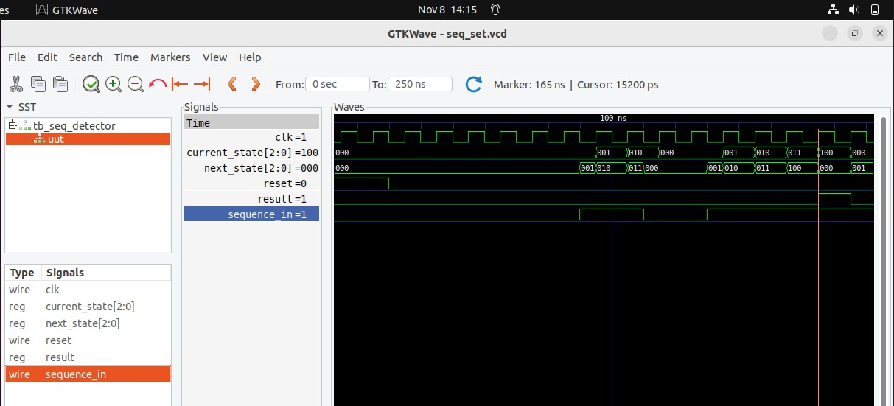

### Netlist representation

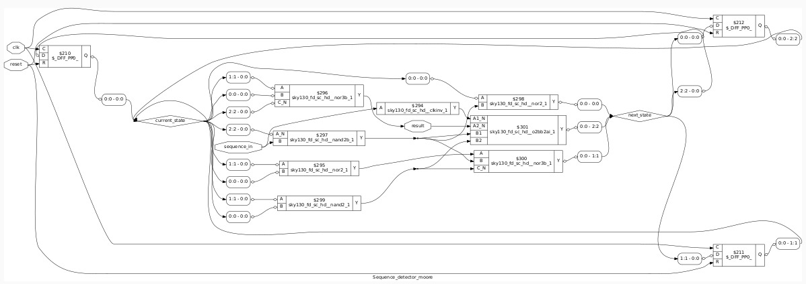

### Statistics after Synthesis

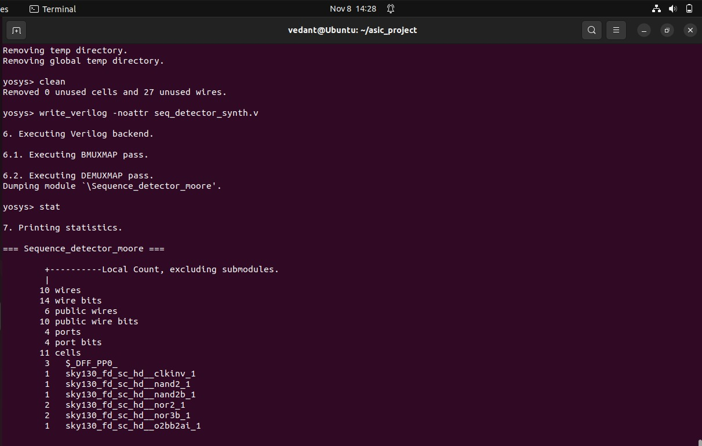

### Pre Synthesis Simulation Result (O1)

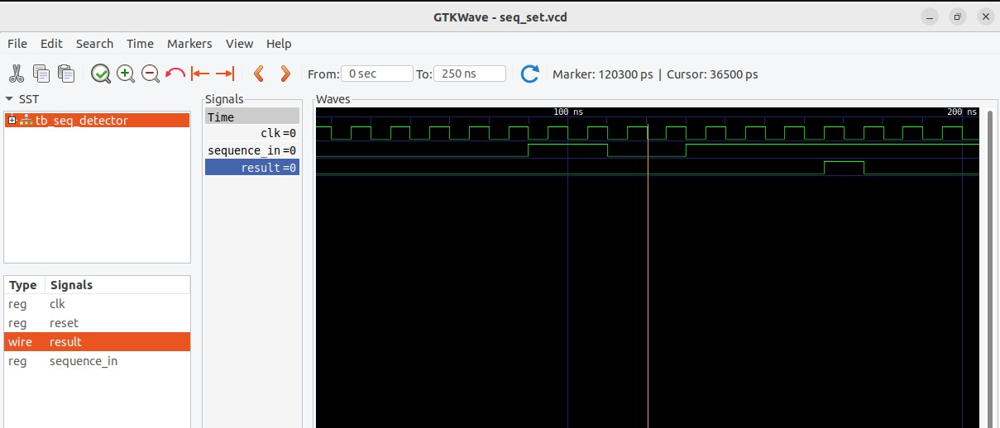

### Post Synthesis Simulation Result (O2)

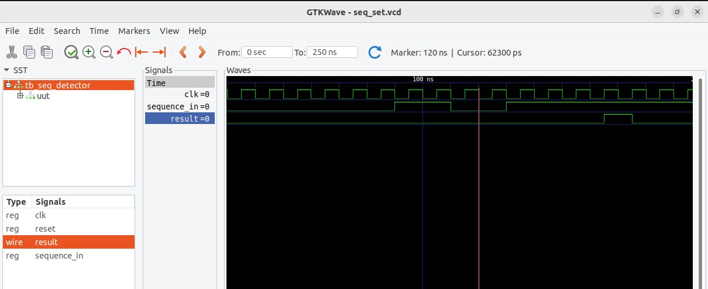

Here we observe that the pre-synthesis output O1 is equal to the post-synthesis output (O2).


## Layout

### Python Installation
```
$   sudo apt install -y build-essential python3 python3-venv python3-pip
```

### Docker Installation
```
$   sudo apt-get update
$   sudo apt-get install docker docker-compose
$   sudo systemctl start docker
$   sudo docker run hello-world
```

*If the docker is successfully installed u will get a success message like below*

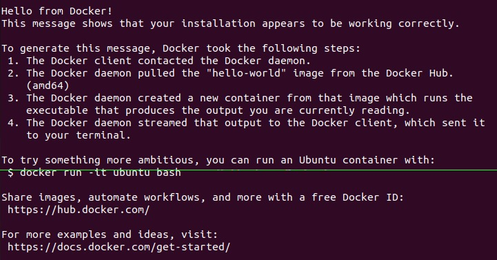

### OpenLANE Installation

OpenLane is an automated RTL to GDSII flow based on several components including OpenROAD, Yosys, Magic, Netgen, CVC, SPEF-Extractor, CU-GR, Klayout and a number of custom scripts for design exploration and optimization. The flow performs full ASIC implementation steps from RTL all the way down to GDSII.

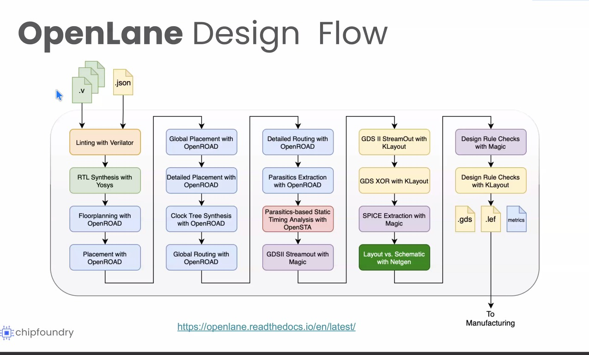

Perform the commands below to install openlane.

```
$   git clone https://github.com/The-OpenROAD-Project/OpenLane.git
$   cd OpenLane/
$   make
$   make test
```

After 43 steps, if it ends with saying - "Basic test passed", then open lane is installed succesfully.


### Magic Installation

For Magic to be installed and for it to work properly the following softwares have to be installed first.

```
$   sudo apt-get install m4 
$   sudo apt-get install tcsh
$   sudo apt-get install csh
$   sudo apt-get install libx11-dev
$   sudo apt-get install tcl-dev tk-dev
$   sudo apt-get install libcairo2-dev
$   sudo apt-get install mesa-common-dev libglu1-mesa-dev
$   sudo apt-get install libncurses-dev
```


#### Installing Magic
```
$   git clone https://github.com/RTimothyEdwards/magic
$   cd magic
$   ./configure
$   make
$   make install
```


### Creating a Custom Inverter Cell

A Custom Inverter Cell is required to create an inverter that can be tweaked based on our requirements and locally used in our design files.

Open the folder you want to create the inverter into on the terminal. Use the commands below to create a custom inverter cell. 

```
$   git clone https://github.com/nickson-jose/vsdstdcelldesign.git
$   cd vsdstdcelldesign
$   cp ./libs/sky130A.tech sky130A.tech
$   magic -T sky130A.tech sky130_inv.mag &
```

Two windows pop up when we run the above magic command, The first window is the Magic Viewport and the second window is the TCL console.

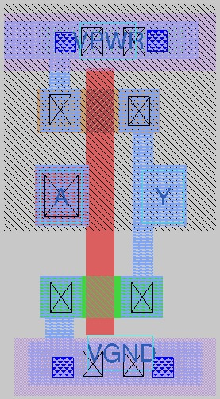

The above layout can be seen in the magic viewport. The design can be verified here and different layers can be seen and examined by selecting the area of examination and typeing `what` in the tcl window.

To extract Spice netlist, use the following commands in tcl window.

```
%   extract all
%   ext2spice cthresh 0 rthresh 0
%   ext2spice
```

*Note that the `cthresh 0 rthresh 0` are used to extract parasitic capacitances from the cell.*

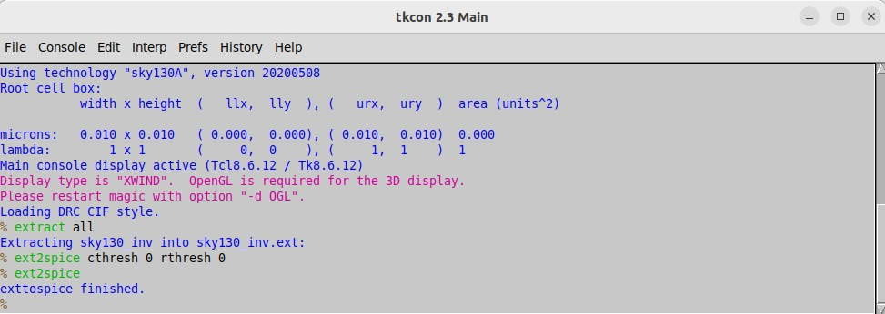

After this step,

The spice netlist has to be edited to add the libraries we are using. To edit the spice netlist navigate to the `vsdstdcelldesign` directory and look for `sky130_inv.spice` file and edit it as shown below.

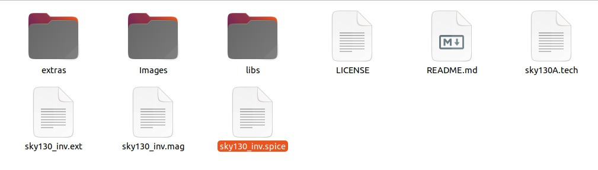

The final spice netlist should look like the following:

```
* SPICE3 file created from sky130_inv.ext - technology: sky130A

.option scale=0.01u
.include ./libs/pshort.lib
.include ./libs/nshort.lib


M1001 Y A VGND VGND nshort_model.0 ad=1435 pd=152 as=1365 ps=148 w=35 l=23
M1000 Y A VPWR VPWR pshort_model.0 ad=1443 pd=152 as=1517 ps=156 w=37 l=23
VDD VPWR 0 3.3V
VSS VGND 0 0V
Va A VGND PULSE(0V 3.3V 0 0.1ns 0.1ns 2ns 4ns)
C0 Y VPWR 0.08fF
C1 A Y 0.02fF
C2 A VPWR 0.08fF
C3 Y VGND 0.18fF
C4 VPWR VGND 0.74fF


.tran 1n 20n
.control
run
.endc
.end
```

Save the above editted file and install the ngspice tool using the commands below.

```
$   sudo apt-get install ngspice
```

Next, open the terminal in the directory where `ngspice` is stored and type the command below. The ngspice console will open.

```
$   ngspice sky130_inv.spice 
```

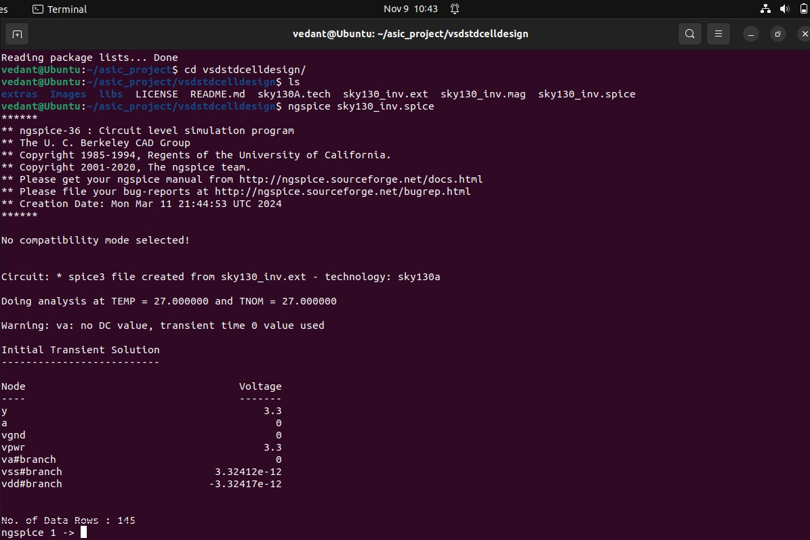


Now to plot the graphs for the designed inverter model, type the command below in the ngspice console.

```
->  plot y vs time a
```


Four timing parameters are used to characterize the inverter standard cell:

1. Rise time: Time taken for the output to rise from 20% of max value to 80% of max value
`Rise time = (2.23843 - 2.17935) = 59.08ps`

2. Fall time- Time taken for the output to fall from 80% of max value to 20% of max value
`Fall time = (4.09291 - 4.05004) = 42.87ps`

3. Cell rise delay = time(50% output rise) - time(50% input fall)
`Cell rise delay = (2.20636 - 2.15) = 56.36ps`

4. Cell fall delay = time(50% output fall) - time(50% input rise)
`Cell fall delay = (4.07479 - 4.05) = 24.79ps`

To get a grid and to ensure the ports are placed correctly we can use this command in the tcl console.

```
%   grid 0.46um 0.34um 0.23um 0.17um
```


To save the file with a different name, use the command below in tcl window.

```
%   save sky130_vsdinv.mag
```

Now open the sky130_vsdinv.mag using the magic command in terminal

```
$   magic -T sky130A.tech sky130_vsdinv.mag
```

In the tcl window type the following command to generate sky130_vsdinv.lef

```
%   lef write
```

*A new `sky130_vsdinv.lef` file be created in the current directory.*


## Layout

### Preparatory Steps

The layout for the design we have been working on can be created using OpenLANE. But before this we have to perform some preparatory steps to run our custom design in OpenLANE. Navigate to the openlane folder and run the commands below.

```
$   cd designs
$   mkdir asic_flow
$   cd asic_flow
$   touch config.json
$   mkdir src
$   cd src
```

Next copy `seq_detector.v`, `sky130_fd_sc_hd__fast.lib`, `sky130_fd_sc_hd__slow.lib`, `sky130_fd_sc_hd__typical.lib` and `sky130_vsdinv.lef` in the src folder. The `seq_detector.v` should be copied from the main repository, and the whole layout procedure will be carried out on this RTL design file.

Post this step, your `src` folder should like below


Next we shall edit the `cofig.json` file.

```
{
    "DESIGN_NAME": "Sequence_detector_moore",
    "VERILOG_FILES": "dir::src/seq_detector.v",
    "CLOCK_PORT": "clk",
    "CLOCK_NET": "clk",
    "GLB_RESIZER_TIMING_OPTIMIZATIONS": true,
    "CLOCK_PERIOD": 10,
    "PL_RANDOM_GLB_PLACEMENT": 1,
    "PL_TARGET_DENSITY": 0.5,
    "FP_SIZING" : "relative",
        
    "LIB_SYNTH": "dir::src/sky130_fd_sc_hd__typical.lib",
    "LIB_FASTEST": "dir::src/sky130_fd_sc_hd__fast.lib",
    "LIB_SLOWEST": "dir::src/sky130_fd_sc_hd__slow.lib",
    "LIB_TYPICAL": "dir::src/sky130_fd_sc_hd__typical.lib",  
    "TEST_EXTERNAL_GLOB": "dir::../asic_flow/src/*",
    "SYNTH_DRIVING_CELL":"sky130_vsdinv",
    
    "pdk::sky130*": {
        "FP_CORE_UTIL": 5,
        "scl::sky130_fd_sc_hd": {
            "FP_CORE_UTIL": 5
        }
    }

}
```

In this file the `DESIGN_NAME` corresponds to the name of the module in your design file also note to change the `CLOCK_PORT` and `CLOCK_NET` variables as per clock used in your design file.


### Errors in config.json

Now the major part where I encountered a lot of errors, was tweaking values in `.json` file based on the design files.

**Mostly occurs in floorplan**
```
1) [ERROR PDN-0175] Pitch 5.04050 is too small for, must be atleast 6.6000
```
For these type of errors just try decreasing the values of:

`PL_TARGET_DENSITY` to 0.6 or 0.5 .

`FP_CORE_UTIL` to half the current value and run the synthesis again.

**Mostly occurs in placement**
```
2) [ERROR GPL-0306] RePlAce diverged at wire/density gradient Sum.
```
For these type of errors :

We can observe the `worst slack value` in red color and trying to bring it to a minimal value tending to zero will help us solve this error. This value can be fixed by reducing the `CLOCK_PERIOD` in `.json` file.

Save all the changes made above and navigate to the OpenLane folder in terminal and run the below command.

```
$   sudo make mount
```

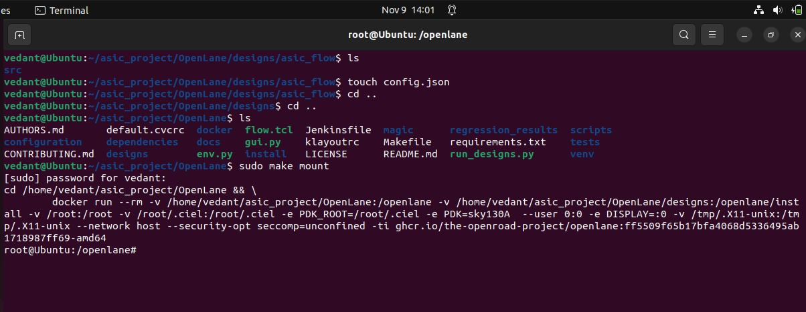

After entering the openlane container give the following command for a step by step procedure:

```
$   ./flow.tcl -interactive
```

This command will open the tcl console. In the tcl console type the following commands:

```
%   package require openlane 1.0.2
%   prep -design asic_flow
```

*In the above command, put the right version of openlane installed.*

The following commands are to merge the external lef files to the `merged.nom.lef.` In our case `sky130_vsdiat.lef` is the external .lef file that gets merged to the lef file.

```
%   set lefs [glob $::env(DESIGN_DIR)/src/*.lef]
%   add_lefs -src $lefs
```

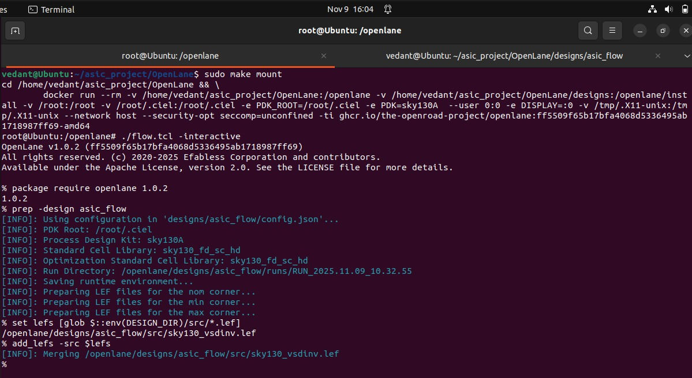

After the merging step, the contents of the `merged.nom.lef` file should contain the Macro definition of `sky130_vsdinv` as shown below.

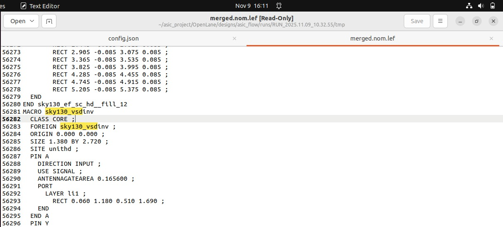


## Synthesis

Run the below command.
```
%   run_synthesis
```

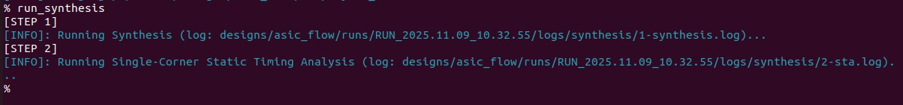

### Synthesis Reports

**Details of the gates used**

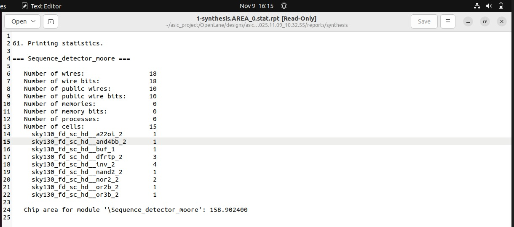

**Setup and Hold Slack after synthesis**

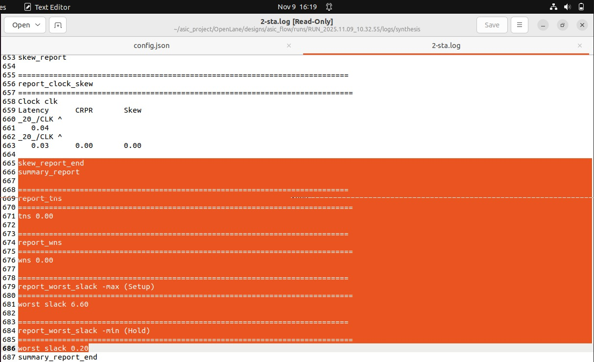

The `sky130_vsdinv` should also reflect in your netlist post Synthesis as shown below.

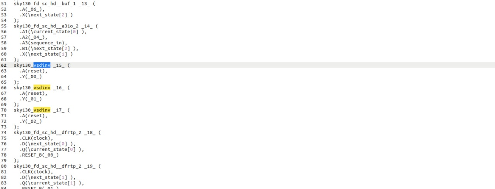


## Floorplan

Run the below command.
```
%   run_floorplan
```

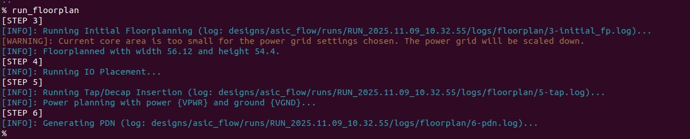

### Floorplan Reports

**Die Area**

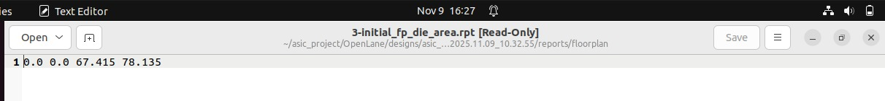

**Core Area**

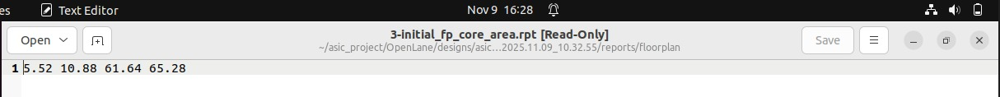

Navigate to results -> floorplan and type the below Magic command in terminal to open the floorplan.

```
magic -T /home/vedant/asic_project/OpenLane/pdks/sky130A/libs.tech/magic/sky130A.tech read ../../tmp/merged.nom.lef def read Sequence_detector_moore.def &
```

**Floorplan View**

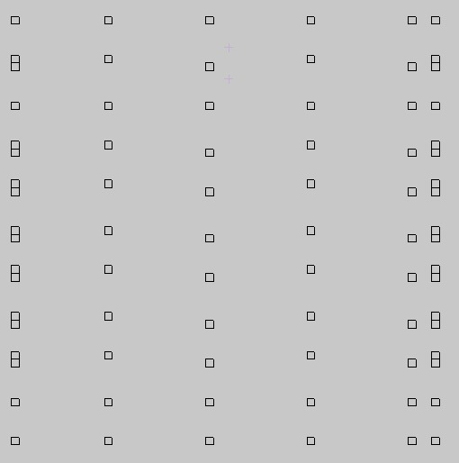

**Zoomed in view of the stacked components pre placement**

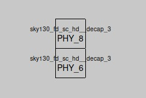


## Placement

Run the below command.
```
%   run_placement
```

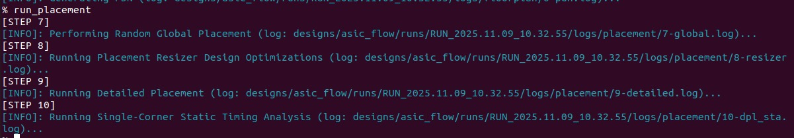


### Placement Reports

**Placement View**

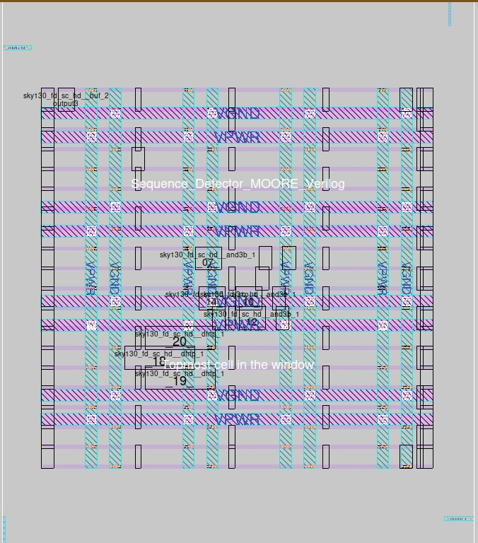

**We can also locate the `sky130_vsdinv` in this view**

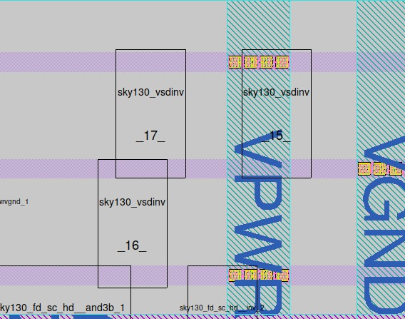

The sky130_vsdinv should also reflect in the netlist post placement as shown below.

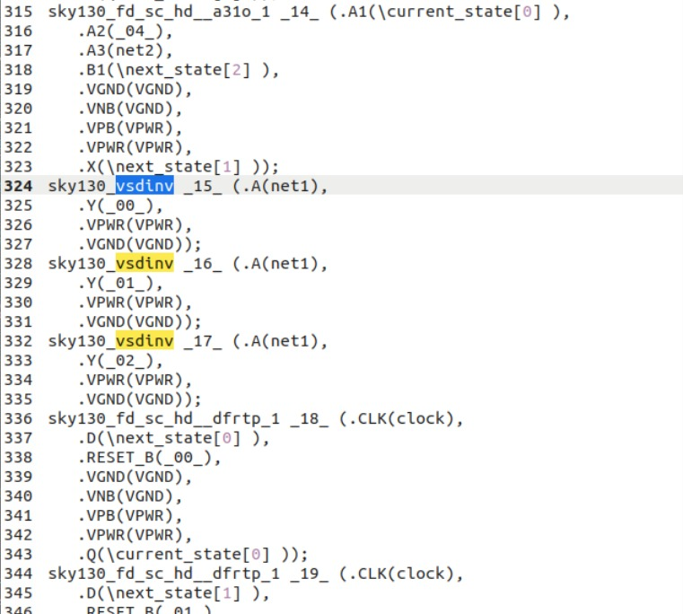


## Clock Tree Synthesis (CTS)

Run the below command.
```
%   run_cts
```

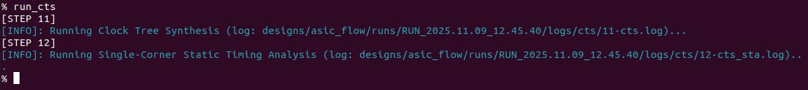


### Timing Reports

**Power and Area**


**Timing Analysis**

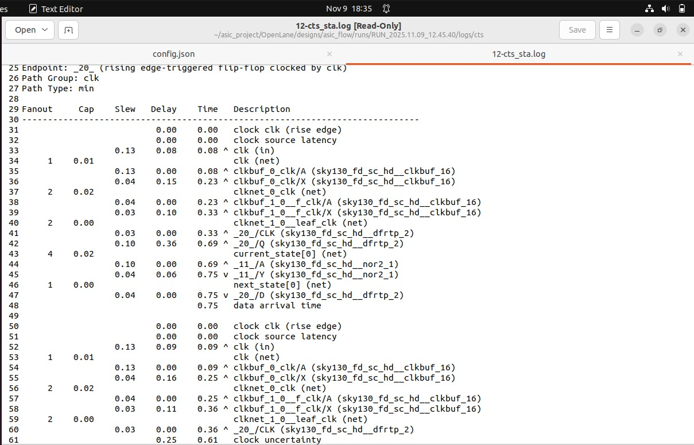


## Routing

Run the below command.
```
%   run_routing
```

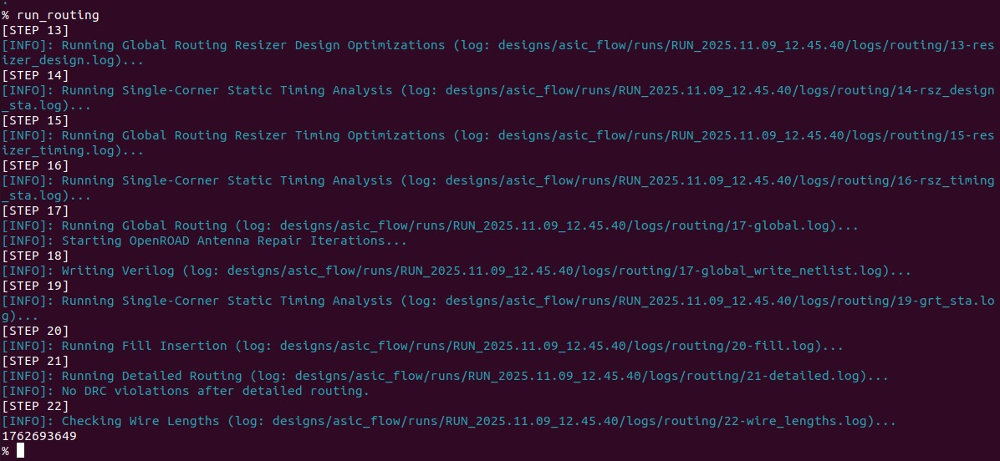


### Routing Reports

Navigate to results->routing and type the below Magic command in terminal to open the placement view.

```
magic -T /home/vedant/asic_project/OpenLane/pdks/sky130A/libs.tech/magic/sky130A.tech read ../../tmp/merged.nom.lef def read Sequence_detector_moore.def &
```

**Routing view**

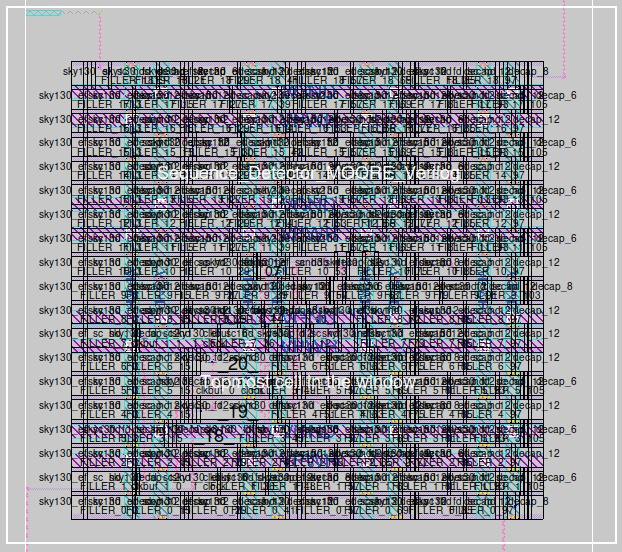

**We can also locate the `sky130_vsdinv` in this view**

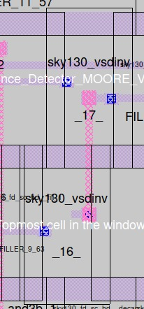

**Area report by magic**

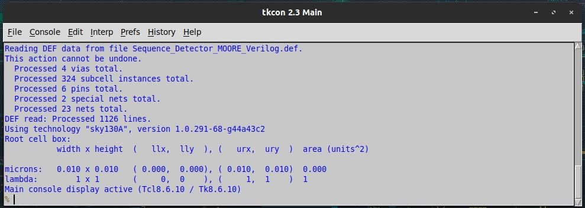

The sky130_vsdinv should also reflect in your netlist post routing as shown below.

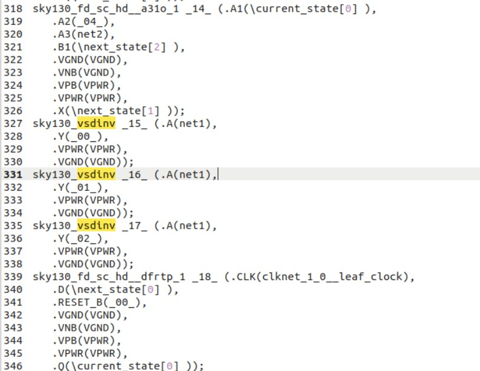


## Results Post_Layout

### 1. Post Layout synthesis gate count


** Gate count = 15 **


### 2. Area (box command)

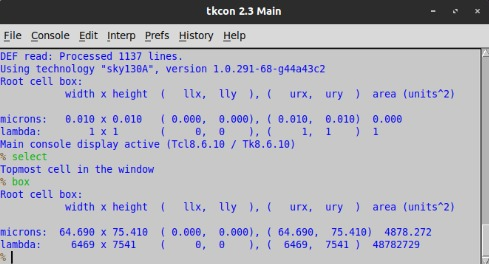


### 3. Performance

Use the below commands.

```

```

** Performance = 1/(clock period - slack) = 1/(6 - 3.78)ns = 470.45 MHz **


### 4. Flop/(Standard Cell Ratio)


** Flop Ratio = Ratio of total number of flip flops / Total number of cells present in the design = 3/15 = 0.200 **


### 5. Power (Internal, Switching, Leakage and Total)

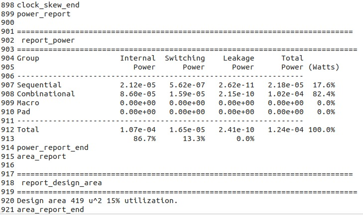

```
Internal Power  = 1.07e-04 W (86.7%)

Switching Power = 1.65e-05 W (13.3%)

Leakage Power   = 2.41e-10 W (0.0%)

Total Power     = 1.24e-04 W (100%)
```
